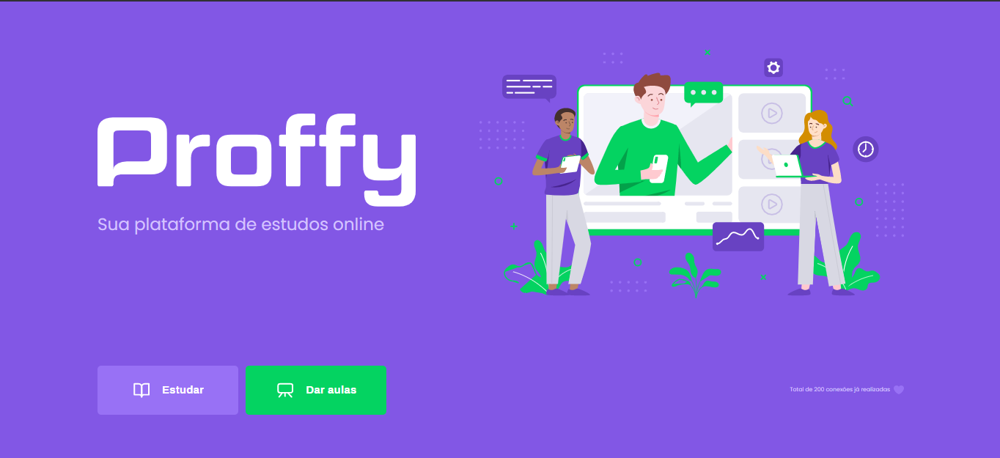

<h1 align="center"> 
    
</h1>

<h1 align="center"> 
    
</h1>

# 📍 Indice
- [Sobre](#-sobre) 
- [Tecnologias](#-tecnologias) 
- [Como baixar](#-baixar) 
- [Como rodar](#-rodar) 

# 💻 Sobre o projeto
A plataforma **Proffy** tem o objetivo de conectar professores e alunos de forma fácil. Os usuários tem a opção de dar aulas ou encontrar um proffy, conforme o filtro selecionado, podendo escolher, quais horários ou matérias desejadas.

Projeto desenvolvido durante a 🚀 **NLW - Next Level Week #02** 🚀 - Oferecida pela **Rocketseat**

---

## 🚀 Tecnologias utilizadas
 - [Express](https://expressjs.com/)
 - [HTML](https://developer.mozilla.org/pt-BR/docs/Web/HTML)
 - [CSS](https://developer.mozilla.org/pt-BR/docs/Web/CSS)
 - [JavaScript](https://www.javascript.com/)
 - [Node](https://nodejs.org/en/)
 - [Nunjucks](https://github.com/mozilla/nunjucks)
 - [SQLite](https://www.sqlite.org/index.html)

---

## 🚨 Como baixar o projeto
Antes de começar, você vai precisar ter instalado em sua máquina as seguintes ferramentas: Git, Node.js. Além disto ter um editor para trabalhar com o código como VSCode

### 🏁 Para rodar a aplicação 

```bash

    # Clonar o repositório
    $ git clone https://github.com/milealmeida/nlw-02-Discovery

    # Entrar no diretório
    $ cd project

    # Instalar as dependências
    $ yarn install

    # Iniciar o projeto
    $ yarn start

```

---
Desenvolvido por Milena Almeida 💙